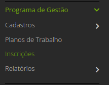
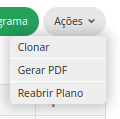
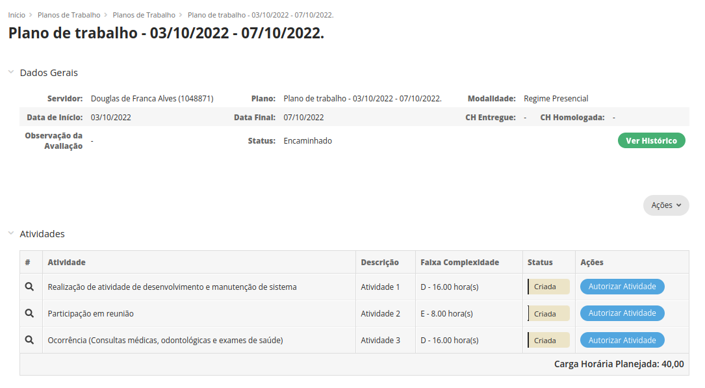
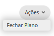

Manuais
=======

Servidores
------------

No módulo do PGD do SUAP, o servidor pode:

* Se inscrever em edital aberto do PGD em sua unidade (campus);
* Propor planos trabalho para execução;
* Executar planos de trabalho propostos;
* Finalizar planos de trabalho avaliados pela chefia imediata;
* Reabrir planos finalizados para correção;
* Acompanhar quadro geral de planos e atividades no PGD.

.. Note::

   Para executar as operações deste manual, o servidor deve possuir usuário ativo no SUAP.

Inscrição em edital
^^^^^^^^^^^^^^^^^^^^

**Passo 1:** Acessar o SUAP.

**Passo 2:** Selecionar o edital em aberto na parte de "FIQUE ATENTO!", na tela inicial do SUAP.

**Passo 3:** Ver informações do edital.

.. image:: info-edital.png

**Passo 4:** Selecionar modalidade que deseja participar no PGD (Presencial, Teletrabalho Parcial, Teletrabalho Integral) e dar aceite em termo de compromisso.

.. image:: inscricao.png

**Passo 5:** Enviar inscrição e aguardar a mensagem "Inscrição realizada com sucesso!".

O acompanhamento da inscrição pode ser realizado através do menu GESTÃO DE PESSOAS - Programa de Gestão - Inscrições.

Proposição de plano de trabalho
^^^^^^^^^^^^^^^^^^^^^^^^^^^^^^^^^^^

**Passo 1:** Acessar o SUAP.

**Passo 2:** Acessar o menu "GESTÃO DE PESSOAS - Programa de Gestão - Planos de Trabalho".

.. image:: menu-plano.png

**Passo 3:** Selecionar a opção "Adicionar Plano".

**Passo 4:** Preencher intervalo do plano (data de início e data de fim).

.. image:: form-plano.png

O usuário será redirecionado para a tela com as informações do plano de trabalho.

**Passo 5:** Deve-se adicionar as atividades ao plano de trabalho.

.. image:: acoes-add-atividade.png

**Passo 6:** Escolher, por atividade, o tipo de atividade (cadastrado na tabela de atividades), a descrição e a faixa de complexidade. O procedimento deve ser executado para todas as atividades do plano.

.. image:: form-add-atividade.png

Após adicionadas todas as atividades o plano deve ficar similar ao seguinte:

**Passo 7:** Ao finalizar o prenchimento do plano deve-se "Encaminhar" para a chefia imediata autorizar.

.. image:: acoes-add-atividade.png

Execução de plano de trabalho
^^^^^^^^^^^^^^^^^^^^^^^^^^^^^^^^^^^

**Passo 1:** Acessar o SUAP.

**Passo 2:** Acessar o menu "GESTÃO DE PESSOAS - Programa de Gestão - Planos de Trabalho".

.. image:: tela-planos-autorizados.png

**Passo 3:** Selecionar plano através da lupa.

**Passo 4:** Selecionar a atividade que deve ser registrada a entrega e selecionar "Registrar Entrega". O sistema irá abrir o formulário de registro da entrega. 

**Passo 5:** Após preenchimento do formulário, selecionar "Salvar". A operação deve ser realizada para todas as atividades.

.. image:: tela-plano-atividades-entregues.png

**Passo 6:** Após todas as atividades entregues, selecionar a opção "Realizar Entrega", para entregar o relatório.

.. image:: acoes-realizar-entrega.png

Caso o relatório tenha atividade entregue, é possível visualizar o cronograma, selecionando o botão "Cronograma".

Um exemplo de cronograma está na tabela a seguir, as atividades em azul estão entregues e as atividades em verde foram avaliadas pela chefia.

O servidor pode visualizar seu quadro geral de participação no PGD através do menu "GESTÃO DE PESSOAS - Programa de Gestão - Relatórios - Meu Boletim.

.. image:: meu-boletim-1.png

Caso haja necessidade de correção, o servidor pode reabrir o plano de trabalho. Para isso:

**Passo 1:** Acessar o SUAP.

**Passo 2:** Acessar o menu "GESTÃO DE PESSOAS - Programa de Gestão - Planos de Trabalho" na aba "Finalizados".

.. image:: planos-finalizados.png

**Passo 3:** Selecionar plano que deseja reabrir através da lupa.

.. image:: tela-plano-finalizado.png

**Passo 4:** Selecionar "Ações - Reabrir plano".

Chefias
----------------

No módulo do PGD do SUAP, a chefia pode:

* Autorizar atividades e planos propostos pelo servidor vinculado;
* Avaliar atividades e planos entregues pelo servidor vinculado;
* Incluir atividades nos planos de trabalho do servidor vinculado;
* Visualizar relatórios de boletins de desempenho do setor vinculado.

.. Note::

Para executar as operações deste manual, a chefia deve possuir usuário ativo no SUAP e habilitação como chefe (titular ou substituto). Esta habilitação deve ser realizada através da gestão de pessoas.

Autorização de atividades e planos
^^^^^^^^^^^^^^^^^^^^^^^^^^^^^^^^^^^

**Passo 1:** Acessar o SUAP.

**Passo 2:** Acessar o menu "GESTÃO DE PESSOAS - Programa de Gestão - Planos de Trabalho" na aba "Encaminhados".

**Passo 3:** Selecionar plano que deseja autorizar através da lupa.

**Passo 4:** Selecionar a atividade que deseja autorizar e selecionar "Autorizar Atividade". Será aberto o formulário de autorização da atividade.

**Passo 5:** Procedimento deve ser realizado para todas as atividades. Por fim, deve-se autorizar o plano através de "Ações - Avaliar".

**Passo 6:** Marcar o plano como "Autorizado" e "Salvar".

O plano autorizado poderá ser executado pelo servidor. Após executado ele será entregue para avaliação da chefia.

Avaliação de atividades entregues
^^^^^^^^^^^^^^^^^^^^^^^^^^^^^^^^^

**Passo 1:** Acessar o SUAP.

**Passo 2:** Acessar o menu "GESTÃO DE PESSOAS - Programa de Gestão - Planos de Trabalho" na aba "Entregues".

**Passo 3:** Selecionar plano que deseja avaliar através da lupa.

.. image:: tela-avaliar-plano.png

**Passo 4:** Selecionar atividade que deseja avaliar e selecionar "Avaliar Entrega". Será aberto o formulário para avaliação da atividade.

.. image:: form-avaliar-entrega-1.png

**Passo 5:** Todas as atividades devem ser avaliadas. A própria chefia também possui permissão de fechar o plano do servidor através de "Ações - Fechar plano"

Estatísticas do setor
^^^^^^^^^^^^^^^^^^^^^^

**Passo 1:** Acessar o SUAP.

**Passo 2:** Acessar o menu "GESTÃO DE PESSOAS - Programa de Gestão - Relatórios - Desempenho".

.. image:: menu-desempenho.png

**Passo 3:** Selecionar o setor para ver desempenho e escolher para selecionar ou não sub-setores na árvore.

.. image:: form-desempenho.png

**Passo 4:** Visualizar boletins de desempenho de participantes do PGD no setor e estatísticas gerais do setor.

