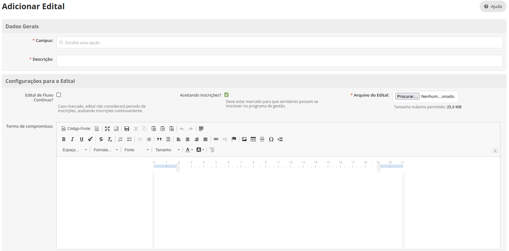
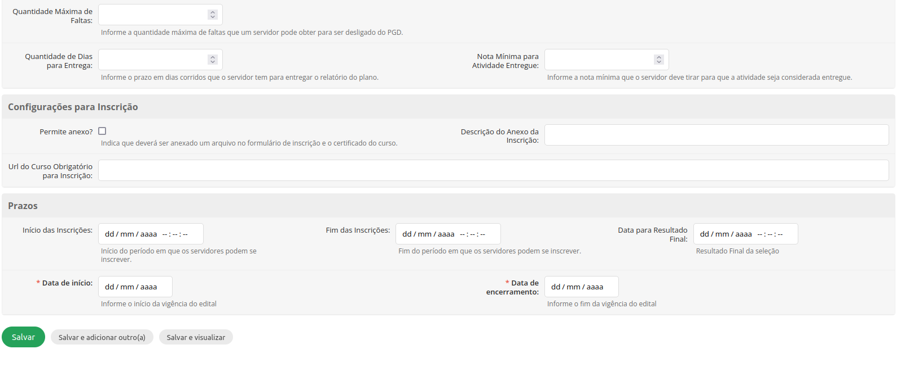
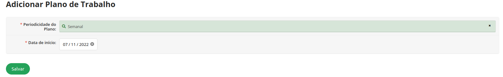
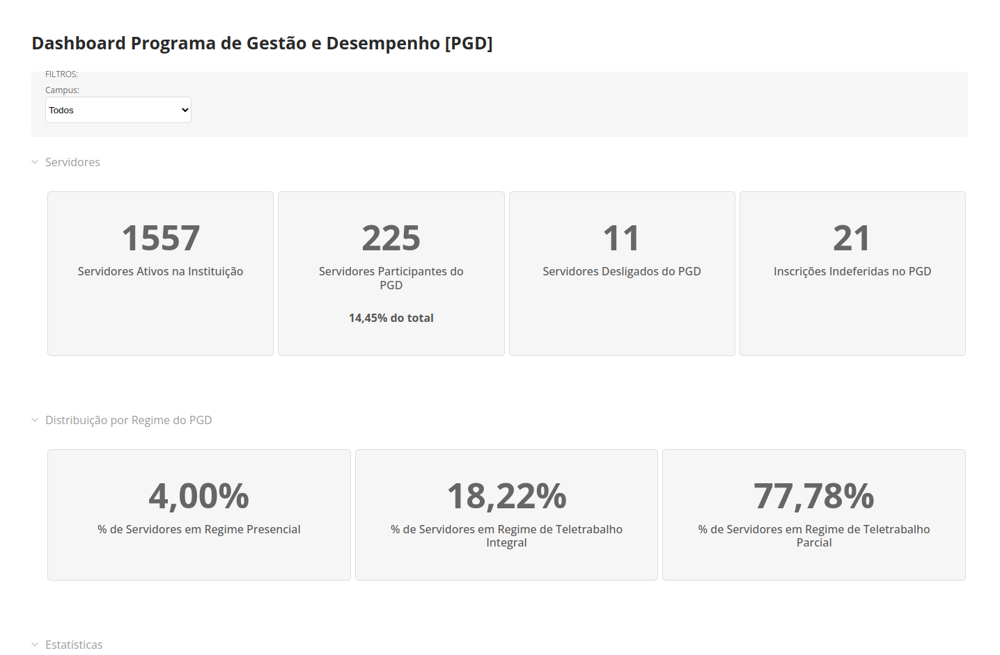

Manuais
=======

Configurações
-------------------------------

O módulo do programa de gestão do SUAP possui os seguintes perfis:

* **Auditoria**: Acesso amplo de visualização a todas as informações do PGD, para fins de auditoria.
* **Avaliador de Prog. de Gestão**: Responsável pelo gerenciamento das inscrições do PGD a nível de unidade, ou seja, cada avaliador poderá deferir, indeferir, desligar inscrições, assim como alterar editais, da sua unidade (campus).
* **Avaliador de Prog. de Gestão Sistêmico**: Responsável pelo gerenciamento das inscrições do PGD de todas as unidades, ou seja, cada avaliador poderá deferir, indeferir, desligar inscrições, assim como alterar editais, de todas as unidades (campus).
* **Coordenador de Prog. de Gestão**: Responsável pelo cadastro da tabela de atividades e de complexidade.
* **Desenvolvimento Institucional**: Visualização de relatórios e indicadores do programa de gestão de todas as unidades.
* **Gestão de Pessoas**: Visualização de relatórios e indicadores do programa de gestão de todas as unidades. 
* **Gestão de Pessoas Campus**: Visualização de relatórios e indicadores do programa de gestão da unidade do usuário habilitado. 
* **Servidor**: Pode participar de editais do programa de gestão, propor planos de trabalho e entregar relatórios.
* **Chefia**: Pode autorizar planos de trabalho e avaliar entregas do relatórios.

Cadastro de Tabela de Complexidade
^^^^^^^^^^^^^^^^^^^^^^^^^^^^^^^^^^

**Passo 1**: Acessar o SUAP.

.. image:: suap.png

**Passo 2**: Acessar o menu "GESTÃO DE PESSOAS - Cadastros - Complexidade".

**Passo 3**: Selecionar "Adicionar Faixa de Complexidade".

**Passo 4**: Preencher formulário e "Salvar".

.. Note::

   * O campo "Tempo de Execução em Presencial" é o tempo estimado que a atividade demora pra ser executada em regime presencial;
   * O campo "Tempo de Execução em Prog. de Gestão" é o tempo estimado que a atividade demora pra ser executada em regime de programa de gestão;
   * O campo "Faixa de Complexidade" é a descrição da faixa de complexidade;
   * O campo "Parâmetros de Complexidade" são os parâmetros adotados para definição da faixa de complexidade cadastrada.

Cadastro de Periodicidade
^^^^^^^^^^^^^^^^^^^^^^^^^^

**Passo 1**: Acessar o SUAP.

.. image:: suap.png

**Passo 2**: Acessar o menu "GESTÃO DE PESSOAS - Cadastros - Periodicidades".

.. image:: menu-periodicidades.png

**Passo 3**: Selecionar "Adicionar Periodicidade dos Planos".

**Passo 4**: Preencher formulário e "Salvar".

.. Note::

   * O campo "Descrição" deve conter a descrição da periodicidade;
   * O campo "Quantidade de Dias" deve conter a quantidade de dias da periodicidade;
   * O campo "Peso das Faltas" deve conter o valor que será multiplicado cada falta do plano de trabalho com aquela periodicidade. Exemplo: se o plano mensal tem peso 4, cada falta que o servidor levar em planos mensais será multiplicada por 4.

Cadastro de Tabela de Atividades
^^^^^^^^^^^^^^^^^^^^^^^^^^^^^^^^^

**Passo 1**: Acessar o SUAP.

.. image:: suap.png

**Passo 2**: Acessar o menu "GESTÃO DE PESSOAS - Cadastros - Atividades".

**Passo 3**: Selecionar "Adicionar Atividade".

**Passo 4**: Preencher formulário e "Salvar".

.. Note::

   * O campo "Título" deve trazer o título da atividade;
   * O campo "Descrição" deve trazer a descrição da atividade;
   * O campo "Entregas Esperadas" deve trazer o rol de entregas que espera-se após a execução da atividade;
   * O campo "Setor da Atividade" deve conter os setores caso a atividade esteja disponível apenas para setores específicos;
   * O campo "Ativo" deve estar marcado para todas as atividades vigentes na tabela de atividades;

Cadastro de Editais
^^^^^^^^^^^^^^^^^^^^^^^^^^^^^^^^^

**Passo 1**: Acessar o SUAP.

.. image:: suap.png

**Passo 2**: Acessar o menu "GESTÃO DE PESSOAS - Cadastros - Editais".

**Passo 3**: Selecionar "Adicionar Edital".

**Passo 4**: Preencher formulário e "Salvar".

.. Note::

   * O campo "Campus" deve trazer o campus (unidade) de vigência do edital;
   * O campo "Descrição" deve trazer a descrição do edital;
   * O campo "Edital de Fluxo Contínuo" deve ser marcado para casos em que a unidade inscreva participantes no programa continuamente;
   * O campo "Aceitando Inscrições" deve ser marcado sempre que seja necessário habilitar o programa de gestão para receber inscrições;
   * O campo "Arquivo do Edital", deve conter o arquivo em formato .pdf do edital, caso este exista;
   * O campo "Termo de Compromisso" deve conter o texto do termo de compromisso, que receberá aceite dos candidatos ao programa de gestão;
   * O campo "Coordenadores do Edital" indica quais usuários receberão permissão para gerir o edital e avaliar inscrições;
   * O campo "Quantidade Máxima de Faltas" deve conter o valor máximo de faltas que um servidor pode obter no PGD para não ser desligado. São consideradas faltas no programa de gestão o envio de plano depois da data de início (encaminhamento com atraso), realização da entrega do plano após prazo (dias corridos) definido em edital para entrega, e atividade não entregue do plano de trabalho (nota menor que a mínima definida no edital);   
   * O campo "Permite anexo?" caso marcado, irá exigir que os candidatos enviem um anexo no formato .pdf no ato de inscrição;
   * O campo "Descrição do Anexo da Inscrição" deve conter a descrição do anexo que será anexado no ato de inscrição e só deve ser preenchido caso o campo "Permite Anexo?" esteja marcado;
   * O campo "Url do Curso Obrigatório para Inscrição" deve conter o link para o curso obrigatório que será exigido certificado no ato de inscrição no programa de gestão;
   * O campo "Início das Inscrições" deve ser preenchido com a data de início do período de inscrição, caso o edital tenha essa etapa. Editais de fluxo contínuo não exigem esse preenchimento;
   * O campo "Fim das Inscrições" deve ser preenchido com a data de fim do período de inscrição, caso o edital tenha essa etapa. Editais de fluxo contínuo não exigem esse preenchimento;
   * O campo "Data para Resultado Final" deve ser preenchido com a data do resultado final do edital, caso o edital tenha essa etapa. Editais de fluxo contínuo não exigem esse preenchimento;
   * O campo "Data de Início" deve ser preenchido com a data de início da vigência do programa de gestão. Os planos de trabalho deverão ser propostos no intervalo definido no edital;
   * O campo "Data de Encerramento" deve ser preenchido com a data de encerramento da vigência do programa de gestão. Os planos de trabalho deverão ser propostos no intervalo definido no edital.      
   
   
Inscrição direta de participantes
^^^^^^^^^^^^^^^^^^^^^^^^^^^^^^^^^^

Editais de fluxo contínuo do PGD permitem que os responsáveis pelo programa, cadastrem participantes diretamente.

**Passo 1:** Acessar o SUAP.

.. image:: suap.png

**Passo 2:** Acessar o menu de editais.

**Passo 3:** Selecionar a opção "Inscrever Participantes" do edital cadastrado.

**Passo 4:** Preencher participantes por regime e "Enviar".

.. Note::

   Para estes casos, não será necessário que o participante se inscreva no programa, ele poderá propor planos diretamente.

Avaliação de inscrições
^^^^^^^^^^^^^^^^^^^^^^^

Caso o programa de gestão tenha etapa de inscrição, os reponsáveis pelo PGD devem avaliar as inscrições

**Passo 1:** Acessar o SUAP.

.. image:: suap.png

**Passo 2:** Acessar o menu "GESTÃO DE PESSOAS - Programa de Gestão - Inscrições", na aba "Pendentes".

**Passo 3:** Selecionar a opção "Avaliar".

.. Note::

   O responsável pelo programa de gestão pode deferir ou indeferir a inscrição realizada.

Servidores
------------

No módulo do PGD do SUAP, o servidor pode:

* Se inscrever em edital aberto do PGD em sua unidade (campus);
* Propor planos trabalho para execução;
* Executar planos de trabalho propostos;
* Finalizar planos de trabalho avaliados pela chefia imediata;
* Reabrir planos finalizados para correção;
* Acompanhar  quadro geral de planos e atividades no PGD.

.. Note::

   Para executar as operações deste manual, o servidor deve possuir usuário ativo no SUAP e inscrição deferida no PGD.

Inscrição em edital
^^^^^^^^^^^^^^^^^^^^

**Passo 1:** Acessar o SUAP.

.. image:: suap.png

**Passo 2:** Selecionar o edital em aberto na parte de "FIQUE ATENTO!", na tela inicial do SUAP.

.. image:: edital-pgd.png

**Passo 3:** Ver informações do edital.

.. image:: info-edital.png

.. Note::

   As informações do edital são cadastradas pela equipe responsável pelo PGD na instituição.

**Passo 4:** Selecionar modalidade que deseja participar no PGD (Presencial, Teletrabalho Parcial, Teletrabalho Integral) e dar aceite em termo de compromisso.

.. image:: inscricao.png

**Passo 5:** Enviar inscrição e aguardar a mensagem **"Inscrição realizada com sucesso!"**.

O acompanhamento da inscrição pode ser realizado através do menu "GESTÃO DE PESSOAS - Programa de Gestão - Inscrições".

.. image:: menu-inscricoes.png

.. image:: minha-inscricao.png

Proposição de plano de trabalho
^^^^^^^^^^^^^^^^^^^^^^^^^^^^^^^^^^^

**Passo 1:** Acessar o SUAP.

.. image:: suap.png

**Passo 2:** Acessar o menu "GESTÃO DE PESSOAS - Programa de Gestão - Planos de Trabalho".

**Passo 3:** Selecionar a opção "Adicionar Plano".

.. image:: add-plano.png

**Passo 4:** Preencher data de início do plano e periodicidade (Semanal, Quinzenal...).

.. Note::

   O sistema só aceitará datas dentro da vigência do edital que o participante foi aprovado. A data de fim do plano de trabalho será calculada automaticamente com base na periodicidade.

O usuário será redirecionado para a tela com as informações do plano de trabalho.

.. image:: tela-plano.png

**Passo 5:** Deve-se adicionar as atividades ao plano de trabalho.

**Passo 6:** Escolher, por atividade, o tipo de atividade (cadastrado na tabela de atividades), a descrição e a faixa de complexidade. O procedimento deve ser executado para todas as atividades do plano.

.. Note::

   * As faixas de complexidade são pré-cadastradas pelas equipes responsáveis pelo PGD. 
   * A carga horária da faixa de complexidade (em programa de gestão) será considerada para fins de planejamento do plano de trabalho.

Após adicionadas todas as atividades o plano deve ficar similar ao seguinte:

.. image:: tela-plano-preenchido.png

**Passo 7:** Ao finalizar o prenchimento do plano deve-se "Encaminhar" para a chefia imediata autorizar.

Execução do plano de trabalho
^^^^^^^^^^^^^^^^^^^^^^^^^^^^^^^^^^^

**Passo 1:** Acessar o SUAP.

.. image:: suap.png

**Passo 2:** Acessar o menu "GESTÃO DE PESSOAS - Programa de Gestão - Planos de Trabalho", na aba "Autorizados".

**Passo 3:** Selecionar plano a ser executado através da lupa.

.. image:: plano-registrar-entrega.png

.. Note::

   * O servidor pode adicionar novas atividades no plano autorizado e reencaminhar para a chefia autorizar através de "Ações - Adicionar Atividade" e "Ações - Encaminhar", respectivamente;
   * O servidor pode cancelar atividades, através do sinal de menos (-) ao lado da lupa.

**Passo 4:** Selecionar a atividade que deve ser registrada a entrega e selecionar "Registrar Entrega". O sistema irá abrir o formulário de registro da entrega. 

.. image:: form-reg-entrega-1.png
.. image:: form-reg-entrega-2.png
.. image:: form-reg-entrega-3.png

.. Note::

   * No campo "Entrega Realizada", deve-se detalhar ao máximo a entrega para avaliação da chefia. Coloque links do que foi produzido para acesso da chefia imediata na hora da avaliação;
   * No campo "Comprovante" é possível anexar um documento em formato .pdf para ajudar a chefia imediata na avaliação da entrega. Não recomenda-se colocar o produto entregue neste campo para evitar duplicações desnecessárias de arquivos;
   * No campo "Data de Início de Execução da Atividade" e "Data de Fim de Execução da Atividade" deve-se colocar as datas, dentro da vigência do plano, que a atividade foi realizada.
   * No campo "Dificuldades", opcionalmente, pode-se relatar as dificuldades encontradas para execução.

**Passo 5:** Após preenchimento do formulário, selecionar "Salvar". A operação deve ser realizada para todas as atividades.

**Passo 6:** Após todas as atividades entregues, selecionar a opção "Realizar Entrega", para entregar o relatório.

Caso o relatório tenha atividade entregue, é possível visualizar o cronograma, selecionando o botão "Cronograma".

.. image:: botao-cronograma.png

Um exemplo de cronograma está na tabela a seguir, as atividades em azul estão entregues e as atividades em verde foram avaliadas pela chefia.

.. image:: cronograma-plano.png

O servidor pode visualizar seu quadro geral de participação no PGD através do menu "GESTÃO DE PESSOAS - Programa de Gestão - Relatórios - Meu Boletim".

.. image:: meu-boletim-2.png

Caso haja necessidade de correção, o servidor pode reabrir o plano de trabalho. Para isso:

**Passo 1:** Acessar o SUAP.

.. image:: suap.png

**Passo 2:** Acessar o menu "GESTÃO DE PESSOAS - Programa de Gestão - Planos de Trabalho", na aba "Finalizados".

**Passo 3:** Selecionar plano que deseja reabrir através da lupa.

**Passo 4:** Selecionar "Ações - Reabrir plano".

.. image:: acoes-reabrir-plano.png

Chefias
----------------

No módulo do PGD do SUAP, a chefia pode:

* Autorizar atividades e planos propostos pelo servidor vinculado;
* Avaliar atividades e planos entregues pelo servidor vinculado;
* Visualizar relatórios e estatísticas do setor vinculado.

.. Note::

Para executar as operações deste manual, a chefia deve possuir usuário ativo no SUAP e habilitação como chefe (titular ou substituto). Esta habilitação deve ser realizada através da gestão de pessoas.

Autorização de atividades e planos
^^^^^^^^^^^^^^^^^^^^^^^^^^^^^^^^^^^

**Passo 1:** Acessar o SUAP.

.. image:: suap.png

**Passo 2:** Acessar o menu "GESTÃO DE PESSOAS - Programa de Gestão - Planos de Trabalho", na aba "Encaminhados".

.. image:: planos-encaminhados.png

**Passo 3:** Selecionar plano que deseja autorizar através da lupa.

.. image:: plano-autorizar.png

**Passo 4:** Selecionar a atividade que deseja autorizar e selecionar "Autorizar Atividade". Será aberto o formulário de autorização da atividade.

.. image:: form-autorizar-atividade.png

**Passo 5:** Procedimento deve ser realizado para todas as atividades. Por fim, deve-se autorizar o plano através de "Ações - Avaliar".

.. image:: acoes-avaliar-plano.png

**Passo 6:** Marcar o plano como "Autorizado" e "Salvar".

.. image:: form-autorizar-plano.png

O plano autorizado poderá ser executado pelo servidor. Após executado ele será entregue para avaliação da chefia. Alternativamente, a chefia pode autorizar todas as atividades e o plano em um único clique, através da opção "Ações - Autorizar Tudo"

Avaliação de atividades entregues
^^^^^^^^^^^^^^^^^^^^^^^^^^^^^^^^^

**Passo 1:** Acessar o SUAP.

.. image:: suap.png

**Passo 2:** Acessar o menu "GESTÃO DE PESSOAS - Programa de Gestão - Planos de Trabalho", na aba "Entregues".

.. image:: planos-entregues.png

**Passo 3:** Selecionar plano que deseja avaliar através da lupa.

.. Note::

   Antes de autorizar todas as atividades, o chefe pode adicionar novas atividades através de "Ações - Adicionar Atividade".

**Passo 4:** Selecionar atividade que deseja avaliar e selecionar "Avaliar Entrega". Será aberto o formulário para avaliação da atividade.

.. image:: form-avaliar-entrega-2.png
.. image:: form-avaliar-entrega-3.png

.. Note::

   * Os "Critérios de Avaliação" e os dados da "Atividade" entregue contém as informações que a chefia tem para avaliar a entrega;
   * O campo nota deve ser preenchido com o valor inteiro de 0 a 10;
   * O campo "carga horária homologada" deve ser preenchido com a carga horária que será considerada para contabilização da carga horária final do plano.

**Passo 5:** Todas as atividades devem ser avaliadas. A própria chefia também possui permissão de fechar o plano do servidor através de "Ações - Fechar plano"

.. image:: acoes-fechar-plano.png

Alternativamente, caso a chefia necessite que o servidor faça alguma correção no plano antes de prosseguir para avaliação, ela deve utilizar a opção "Ações - Devolver Plano"

Estatísticas do setor
^^^^^^^^^^^^^^^^^^^^^^

**Passo 1:** Acessar o SUAP.

.. image:: suap.png

**Passo 2:** Acessar o menu "GESTÃO DE PESSOAS - Programa de Gestão - Relatórios - Desempenho".

.. image:: menu-desempenho.png

**Passo 3:** Selecionar o setor para ver desempenho e escolher para selecionar ou não sub-setores do organograma.

**Passo 4:** Visualizar boletins de desempenho de participantes do PGD no setor e estatísticas gerais do setor.

.. image:: estatisticas-setor-1.png
.. image:: estatisticas-setor-2.png

A chefia também pode acompanhar as situações dos planos através da tela inicial do SUAP:

Relatórios Públicos
--------------------

**Painel Público de Indicadores**

**Passo 1:** Acessar o SUAP.

.. image:: suap.png

**Passo 2:** Na própria tela de login, acessar menu do Programa de Gestão e Desempenho.

**Passo 3:** Selecionar "Painel"

**Planos de Trabalho**

**Passo 1:** Acessar o SUAP.

.. image:: suap.png

**Passo 2:** Na própria tela de login, acessar menu do Programa de Gestão e Desempenho.

**Passo 3:** Selecionar "Planos de Trabalho"

